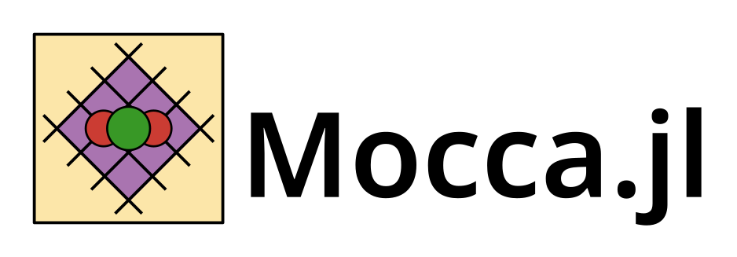

# Mocca




Mocca [Mocca.jl](https://github.com/sintefmath/Mocca.jl) provides a [Julia](https://julialang.org/) based framework for the simulating pressure / temperature swing adsorption processes for CO2 capture.

Currently there is an implementation of a 4-stage vacuum swing adsorption process for CO2 capture, from a two-component flue gas, using Zeolite 13X and a dual-site Langmuir model. See [Direct Column Breakthrough simulation](https://github.com/sintefmath/Mocca.jl/blob/main/examples/simulate_DCB.jl) and [Cyclic Vacuum Swing Adsorption simulation](https://github.com/sintefmath/Mocca.jl/blob/main/examples/simulate_cyclic.jl). Additionally, we have made examples demonstrating capabilities for doing [Optimization](https://github.com/sintefmath/Mocca.jl/blob/main/examples/optimization.jl) and [History matching](https://github.com/sintefmath/Mocca.jl/blob/main/examples/history_matching.jl) in Mocca.jl.

In the future we hope to implement examples of other systems and isotherms e.g. temperature swing adsorption for Direct Air Capture (DAC).

# Installation

First install Julia from [here](https://julialang.org/downloads/). 

Mocca can be downloaded by cloning the Mocca.jl repository.

We recommend running in a specific environment (similar to a virtual environment in python). More information on environments in Julia can be found [here](https://pkgdocs.julialang.org/v1/environments/).

To create an environment in Mocca.jl navigate to the Mocca.jl folder, start the [Julia REPL](https://docs.julialang.org/en/v1/stdlib/REPL/) and type the following at the Julia prompt:

```julia
Pkg.activate(".")
Pkg.instantiate()
```

This will activate the environment in the current directory and install all necessary dependencies. Mocca is now installed and ready to use.

To get started try the [quick_start](@ref) or [Direct Column Breakthrough simulation](@ref) examples. Bear in mind that the first time you run the code in the Julia REPL it may take several minutes to run as Julia needs to compile all the necessary code. As long as you do not close the REPL, the second time you run the code will be much quicker!


# Quick start example
Run the following code to quickly setup and run a
Direct Column breakthrough adsorption simulation using predefined input parameters.

The example uses some utility functions which simplify the simulation setup.
To see the steps used in more detail, please refer to the
[Simulate DCB](simulate_DCB.md) example.

```julia
using Mocca

# Import and load input parameters
json_dir = joinpath(dirname(pathof(Mocca)), "../models/json/")
filepath = joinpath(json_dir, "haghpanah_DCB_input_simple.json")
(constants, info ) = Mocca.parse_input(filepath)

# Setup and run simulation
case, ts_config = Mocca.setup_mocca_case(constants, info)
states, timesteps = Mocca.simulate_process(case; timestep_selector_cfg = ts_config,
    output_substates = true, info_level = 0)

# Save results to CSV and plot
Mocca.export_cell_results(joinpath(Mocca.moccaResultsDir, "haghpanah_DCB_results.csv"),
    case, states, timesteps; format="csv")
f = Mocca.plot_outlet(case, states, timesteps)
display(f)
```

# Acknowledgements

The authors would like to thank Shreenath Krishnamurthy, SINTEF Industry and Gokul Subraveti, SINTEF Energy for assistance developing the code. 
This project has received funding from the following projects:
- SINTEF Digital Strategic Development Fund
- FME gigaCCS administered by the Research Council of Norway (350370). 
